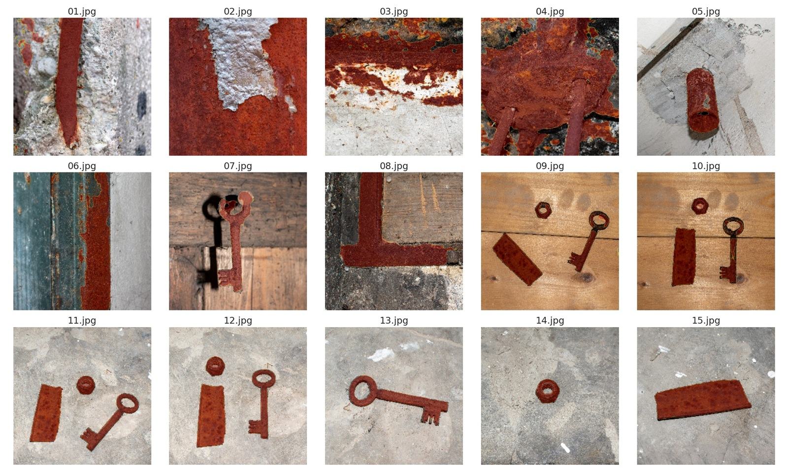

# Corrosion Segmentation in Industrial Complexes in Ostrava

This project explores the use of advanced deep neural networks for semantic segmentation to detect surface corrosion on metal structures. Corrosion is a serious global risk, with potentially catastrophic consequences such as bridge collapses. Early detection is therefore essential to reduce economic losses and enhance public safety. To support this effort, a new dataset of 105 corrosion images was collected at industrial sites in Ostrava, Czech Republic [[1]](#ref1). The top-performing model, which combines a ResNet50 backbone with a UNet++ decoder, achieved an F1 score of 0.933 and an IoU of 0.879 on the test set.



## Quick Start

1. Download the dataset *Corrosion in Industrial Complexes in Ostrava* [[1]](#ref1). Use the provided script [`download_dataset.sh`](./download_dataset.sh) or download it manually from Zenodo [https://doi.org/10.5281/zenodo.11235637](https://doi.org/10.5281/zenodo.11235637).
2. Run the following command to create a Docker image with all dependencies (assumes you have [Docker](https://www.docker.com/) and [just](https://github.com/casey/just) installed):

    ```shell
    just notebook
    ```

3. Connect to the Jupyter server running in the Docker container created in the previous step by opening your web browser and navigating to [http://localhost:8888](http://localhost:8888).
4. Open the Jupyter notebook [`notebooks/inference.ipynb`](./notebooks/inference.ipynb) for an example inference.

## References

1. <a name="ref1"></a> Frič, M. (2024). Corrosion in Industrial Complexes in Ostrava [Data set]. Zenodo. [https://doi.org/10.5281/zenodo.11235637](https://doi.org/10.5281/zenodo.11235637)
